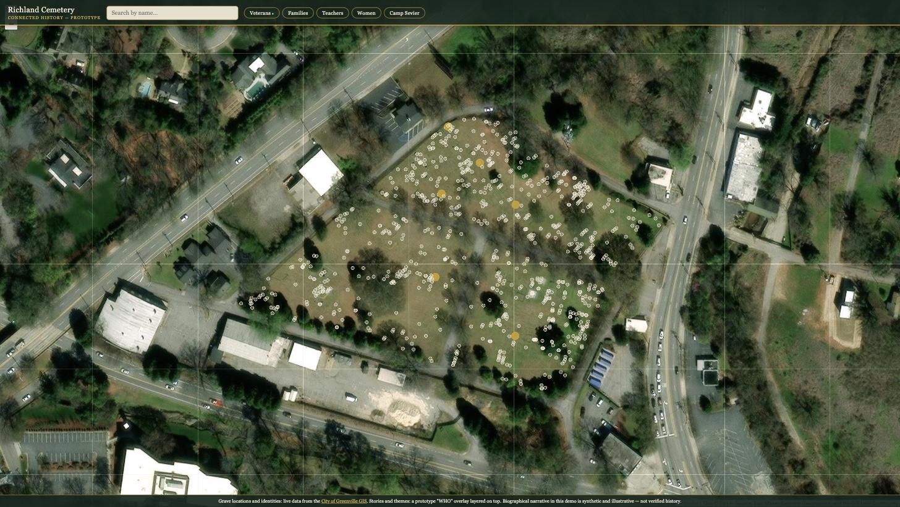
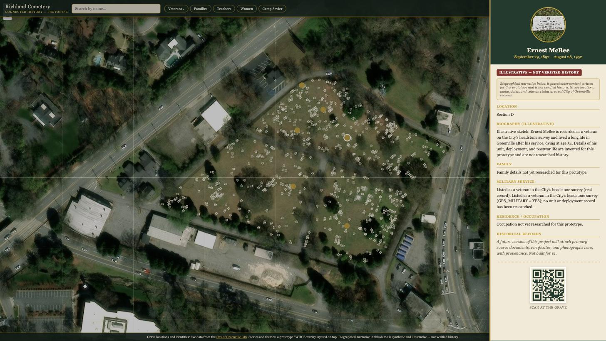
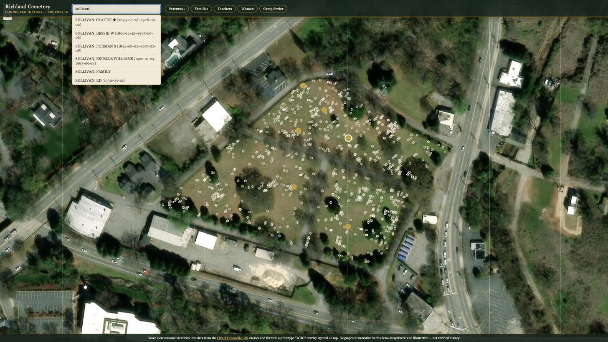

# Richland Cemetery — Connected History

A v1 prototype that fuses the City of Greenville's public cemetery GIS data with a
lightweight narrative layer, so a visitor can search a topic, see real graves on a
real map, tap one, and read that person's story.

**→ [Open the live demo](https://richland-connected-history.pages.dev)**

> Pro bono consulting project for a non-profit. The grave data is real and live.
> The biographies are written for this prototype, are clearly marked as such, and
> are not verified history.

<p align="center">
  
  <br>
  <em>836 burial records, loaded from the City of Greenville GIS when the page
  opens. 82 of them are marked as veterans.</em>
</p>

<p align="center">
  
  <br>
  <em>The record panel. Grave location, name, dates and veteran status are real City
  records; every invented field sits under the red badge and says so.</em>
</p>

<p align="center">
  
  <br>
  <em>Search runs against the name fields in the live GIS data, not a local copy.</em>
</p>

## Why this exists

Richland Cemetery, in Greenville, South Carolina, is a historically significant
African American cemetery whose written records were largely lost to fire. The City
of Greenville already maintains an excellent geographic record — names, dates,
section/lot, and hundreds of real grave locations, all public via GIS. What's missing
is the "who": the reconstructed lives, families, and stories of the people buried
there. One veteran cluster this project's volunteers already turned up by hand: a run
of headstones near Sunflower Street and Magnolia Drive, all men who trained together
at Camp Sevier and died of pneumonia within the same stretch of time — the kind of
story that's invisible on a map until someone connects the dots.

The long-term vision (from the project's own planning materials) is a full relational
"who" database, built with proper consultant and archival support, delivering
on-demand thematic tours — Veterans, Families, Camp Sevier, Women, Teachers — that
visitors experience by scanning a code or NFC chip at the grave. This prototype is a
proof of that thesis, not the thesis itself.

## What this prototype proves

That the City's real geographic data can be fused with a minimal narrative overlay
into one working loop: **search → map → pin → record**. Specifically:

- A live aerial map of Richland Cemetery with ~836 real grave points, pulled at
  runtime from the City's ArcGIS service — never copied into the app.
- Name search across the real City data.
- A **live** "Veterans" filter, computed directly from the City's own military-service
  field — no extra research required to unlock that first thematic tour.
- A small set of seeded people with a richer, deck-styled record panel: family,
  military service, occupation, community, a QR code for a future scan-at-grave flow.
- A plain, honest popup for every other real grave: location and dates, with
  "historical profile not yet researched" — itself part of the story, since most
  graves currently have a *where* and are waiting on a *who*.

## What's explicitly not here yet

This is a pitch-quality prototype, not the production system. Left out on purpose,
with clean seams to add them later:

- The full relational data model (this prototype uses a flat, disposable 13-field
  overlay, not the ~50-field schema the eventual database consultants will design).
- Real, researched biographies — every narrative in this prototype is **synthetic and
  clearly labeled `ILLUSTRATIVE`**. Names, dates, coordinates, section/lot, and
  veteran status are real City records; the life stories built around them are not.
- An evidence/document layer (source certificates, photographs, provenance).
- Multi-stop guided tour routing.
- NFC or other physical hardware at the grave (a QR code stands in for this).
- Write-back/editing and user accounts.

## How it works

Two data sources, joined in the browser by a stable `INTERMENT_ID`:

- **WHERE** — the City of Greenville's public ArcGIS layer, queried live through a
  same-origin proxy (so there's no CORS friction and the response can be edge-cached).
- **WHO** — a thin CSV overlay holding only what the City doesn't have: bio, family,
  occupation, community, themes. Sourced from a published Google Sheet when
  configured, falling back to a bundled CSV otherwise, so the app always runs.

Stack: Vite + React, Leaflet for mapping, Papa Parse for CSV, deployed to Cloudflare
Pages with two edge Functions (an access gate and the GIS proxy).

## Try it

The live prototype is deployed and access-gated with a shared code — reach out to the
project team for access. It's intentionally casual protection for a pitch demo, not a
hardened system.

## Running it yourself

Requires Node.js 18+ and a (free) Cloudflare account.

```zsh
git clone <this-repo-url>
cd richland-cemetery-prototype
npm install
```

**Local dev** — runs the React app only; `/api/interments` needs a Cloudflare Pages
Function to answer it, which plain `vite dev` doesn't provide:

```zsh
npm run build
npx wrangler pages dev dist
```

This serves the built app plus both Pages Functions (`functions/_middleware.js`,
`functions/api/interments.js`) together on `http://localhost:8788`, so the access
gate and the live GIS proxy both work exactly as in production. Log in with the
access code hardcoded in `functions/_middleware.js` (`ACCESS_CODE`).

**Deploy to your own Cloudflare account:**

```zsh
npx wrangler login                     # opens a browser to authenticate
npx wrangler pages project create <your-project-name>
npm run build
npx wrangler pages deploy dist --project-name <your-project-name>
```

Wrangler prints the public URL on success. No account ID or API token needs to be
committed anywhere — `wrangler login` handles auth interactively, and `wrangler.toml`
in this repo only sets the build output directory and compatibility date.

**Optional:** to make the "WHO" narrative layer live-editable without a redeploy,
publish a Google Sheet as CSV (File > Share > Publish to web > CSV) with the same
columns as `public/data/seed-who.csv`, and paste the URL into `SHEET_CSV_URL` in
`src/config.js`. Leave it empty to keep using the bundled CSV.

## Data & sourcing

Grave locations, names, dates, and veteran status come from the City of Greenville's
public GIS service and are shown as-is. All biographical narrative is invented for
demonstration purposes and is marked accordingly in the interface — this project takes
seriously that it concerns real people and a historically significant community
cemetery, and does not present synthetic content as verified history anywhere in the
app.

## Status

v1 prototype, built and deployed. See `brief.md` for the full build spec this was
built from, and `handoff.md` for build notes, known issues, and next steps.
